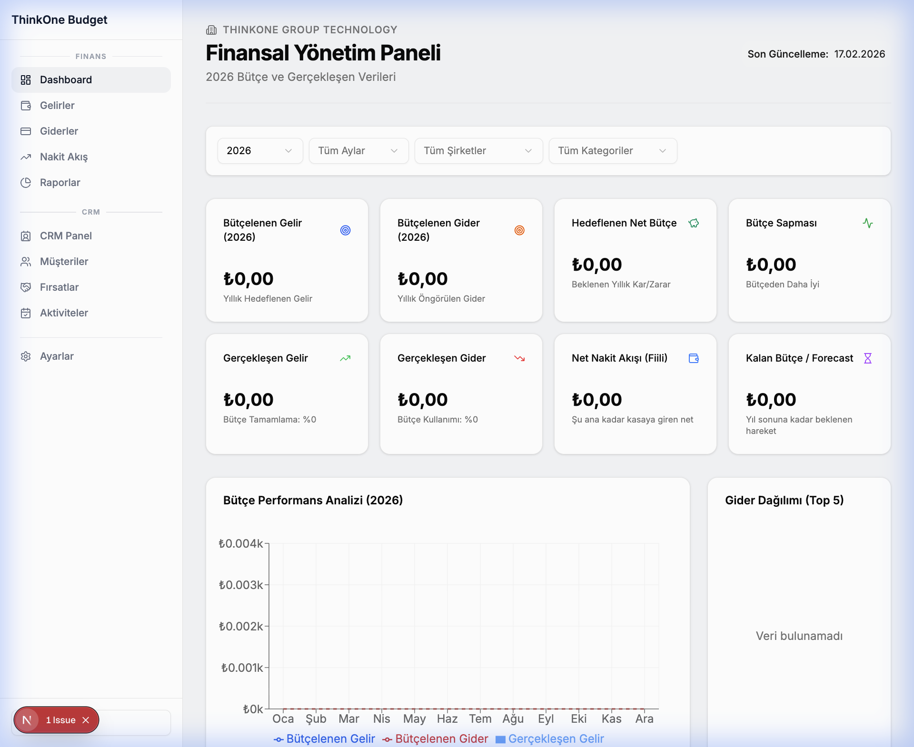
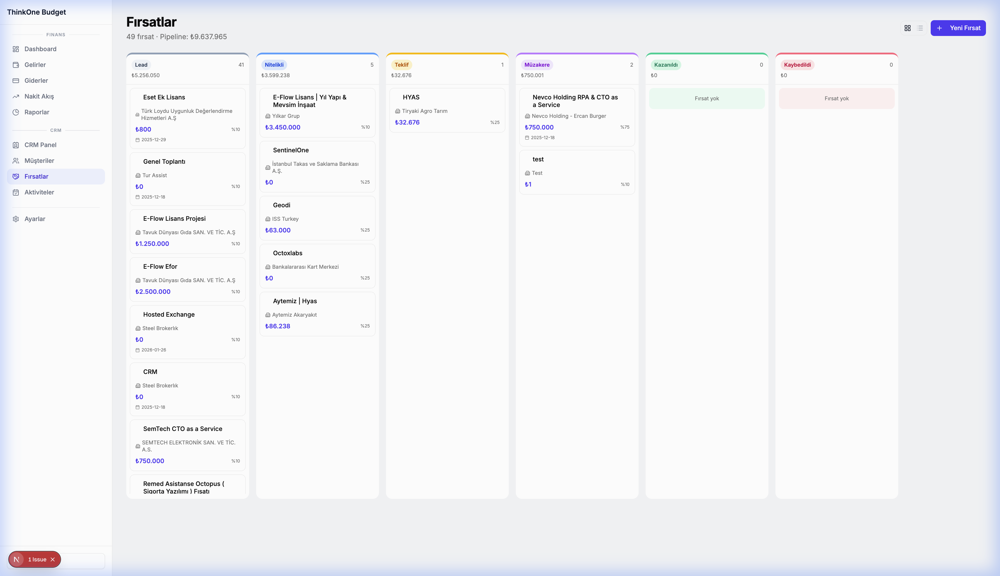

# ThinkOne Budget & CRM

Bütçe takibi ve müşteri ilişkileri yönetimi için geliştirilmiş, modern ve kapsamlı bir web uygulaması.



## ✨ Özellikler

### 🏦 Finans Modülü

- **Dashboard** — Bütçelenmiş gelir/gider, gerçekleşen tutarlar, nakit akışı ve sapma analizi
- **Gelir & Gider Yönetimi** — Şirket ve kategoriye göre bütçe ve gerçekleşen takibi
- **Nakit Akış Tablosu** — Aylık nakit akış detayları
- **Raporlama** — Detaylı finansal raporlar
- **Grafikler** — Şirket ve kategori bazlı bütçe dağılımı (gelir + gider karşılaştırmalı)
- **Filtreler** — Şirket, kategori ve dönem bazlı filtreleme

### 🤝 CRM Modülü

- **CRM Panel** — Pipeline özeti, son fırsatlar ve aktiviteler
- **Müşteri Yönetimi** — Müşteri kartları, arama, filtreleme, detay sayfası
- **Fırsat / Deal Yönetimi** — Kanban board (sürükle-bırak), liste görünümü
- **İletişim Kişileri** — Müşterilere bağlı kişi yönetimi
- **Aktiviteler** — Arama, toplantı, e-posta, not ve görev takibi
- **Excel Import** — CRM verilerini Excel'den toplu aktarma



### ⚙️ Ayarlar

- Gelir/gider kategorileri ve şirket yönetimi
- CRM pipeline aşamaları ve genel konfigürasyon
- Tüm ayarlar tek sayfada, sekmeli yapıda

## 🛠️ Teknolojiler

| Teknoloji | Kullanım |
|---|---|
| [Next.js 15](https://nextjs.org/) | React framework (App Router) |
| [Prisma](https://www.prisma.io/) | ORM & veritabanı yönetimi |
| SQLite | Veritabanı |
| [shadcn/ui](https://ui.shadcn.com/) | UI bileşenleri |
| [Tailwind CSS](https://tailwindcss.com/) | Styling |
| [Recharts](https://recharts.org/) | Grafik kütüphanesi |
| [Lucide React](https://lucide.dev/) | İkon seti |

## 🚀 Kurulum

### Gereksinimler

- Node.js 18+
- npm veya yarn

### Adımlar

```bash
# Repo'yu klonlayın
git clone https://github.com/gurkantaskiran-tr/budget-app.git
cd budget-app

# Bağımlılıkları yükleyin
npm install

# Veritabanını oluşturun
npx prisma db push

# Geliştirme sunucusunu başlatın
npm run dev
```

Uygulama varsayılan olarak [http://localhost:3000](http://localhost:3000) adresinde çalışır.

### CRM Verisi Import (Opsiyonel)

Excel dosyasından CRM verisi aktarmak için:

```bash
npx xlsx-cli <excel-dosyası.xlsx> | node scripts/import_crm.js
```

## 📁 Proje Yapısı

```
budget-app/
├── prisma/
│   ├── schema.prisma       # Veritabanı şeması
│   └── dev.db              # SQLite veritabanı
├── scripts/
│   ├── import_crm.js       # Excel → CRM import scripti
│   └── analyze_crm.js      # Excel analiz aracı
├── src/
│   ├── app/
│   │   ├── page.tsx         # Dashboard
│   │   ├── income/          # Gelirler
│   │   ├── expenses/        # Giderler
│   │   ├── cashflow/        # Nakit akış
│   │   ├── reports/         # Raporlar
│   │   ├── settings/        # Ayarlar
│   │   └── crm/             # CRM modülü
│   │       ├── page.tsx     # CRM panel
│   │       ├── customers/   # Müşteriler
│   │       ├── deals/       # Fırsatlar
│   │       └── activities/  # Aktiviteler
│   ├── components/
│   │   ├── crm/             # CRM bileşenleri
│   │   ├── dashboard/       # Dashboard grafikleri
│   │   └── ui/              # shadcn/ui bileşenleri
│   ├── config/
│   │   └── nav.ts           # Navigasyon yapılandırması
│   └── lib/
│       ├── actions.ts       # Finans server actions
│       ├── crm-actions.ts   # CRM server actions
│       └── prisma.ts        # Prisma client
├── screenshots/             # Ekran görüntüleri
├── CHANGELOG.md             # Değişiklik günlüğü
└── LICENSE                  # MIT Lisans
```

## 📋 Changelog

Tüm değişiklikler [CHANGELOG.md](CHANGELOG.md) dosyasında belgelenmiştir.

## 📜 Lisans

Bu proje [MIT Lisansı](LICENSE) altında lisanslanmıştır.

---

**ThinkOne Group Technology** tarafından geliştirilmiştir.
